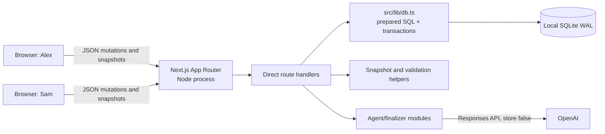

# Launch Room Technical Design

## Overview

Launch Room is a one-day, single-process Next.js MVP for two anonymous browser sessions to turn planning cards into a reviewed Markdown artifact. The implementation optimizes for the exact required demo path: create and join a room, synchronize human cards by polling, explicitly run one Product Agent, approve or reject its proposed cards, then generate and export a final artifact containing only eligible content.

The design deliberately uses direct App Router route handlers, one small SQLite helper, compact snapshots, and client-side polling. It excludes optional enhancements, production authorization, push infrastructure, service/repository layers, and heavy test infrastructure.

### Research findings and fixed decisions

The authoritative core brief and its checked official references establish the implementation baseline. The design therefore pins Node `24.18.0`, Next.js `16.2.10`, React `19.2.7`, TypeScript `6.0.3`, Tailwind `4.3.2`, `better-sqlite3` `12.11.1`, OpenAI SDK `6.46.0`, Zod `4.4.3`, and `react-markdown` `10.1.0`. Next.js App Router Node route handlers can host the local native SQLite dependency; every database route explicitly exports `runtime = "nodejs"`. OpenAI Responses structured output integrates with Zod through `zodTextFormat`, allowing model output to be parsed before it crosses the persistence trust boundary. SQLite WAL, foreign keys, a 5-second busy timeout, and one process-wide connection are appropriate only for the stated local, single-instance deployment. Sources: [Next.js Route Handlers](https://nextjs.org/docs/app/getting-started/route-handlers), [Next.js Node runtime](https://nextjs.org/docs/app/api-reference/file-conventions/route-segment-config/runtime), [Next.js native packages](https://nextjs.org/docs/app/api-reference/config/next-config-js/serverExternalPackages), [OpenAI structured outputs](https://developers.openai.com/api/docs/guides/structured-outputs), and [`better-sqlite3`](https://github.com/WiseLibs/better-sqlite3).

## Architecture



### Boundaries

- **Client boundary:** React client components hold the last valid snapshot, local form state, connection state, and browser identity. They never receive secrets or choose persisted ownership, status, IDs, or timestamps.
- **HTTP boundary:** Direct route handlers parse JSON with Zod, resolve room membership from `roomId + clientId`, verify referenced records belong to the room, and return compact success data or a Safe Error.
- **Persistence boundary:** `src/lib/db.ts` owns connection initialization, schema application, prepared statements, transactions, row mapping, and source-ID JSON serialization. No ORM or generic repository layer is introduced.
- **AI trust boundary:** Agent modules construct compact allowlisted context, perform one structured-output request, validate parsed output again, remove foreign or nonexistent source IDs, and assign all trusted metadata server-side.
- **Deployment boundary:** One local Node process and one local SQLite file. Anonymous links and Client IDs are coordination conveniences, not authorization suitable for confidential or production data.

### Exact two-browser demo sequence

```mermaid
sequenceDiagram
  actor Alex
  participant A as Alex browser
  participant API as Next.js route handlers
  participant DB as SQLite
  participant AI as OpenAI Responses API
  participant S as Sam browser
  actor Sam

  Alex->>A: Submit Weekend Launch form
  A->>API: POST /api/rooms (clientId, inputs)
  API->>DB: Transaction: room + Alex + initial Problem card
  DB-->>API: Commit
  API-->>A: roomId
  A->>A: Store clientId and nickname; navigate /room/[roomId]
  A->>API: GET room snapshot
  API-->>A: Initial board
  Sam->>S: Open shared URL; submit nickname
  S->>API: POST /api/rooms/[roomId]/join
  API->>DB: Upsert Sam participant transaction
  API-->>S: Joined
  S->>S: Store clientId and nickname
  S->>API: POST Requirement human card
  API->>DB: Insert active card transaction
  API-->>S: Success; refetch snapshot
  loop Visible every ~1.25 seconds
    A->>API: GET room snapshot (no overlap)
    API-->>A: Snapshot containing Sam's card
  end
  Alex->>A: Invite Product Agent
  A->>API: POST /api/rooms/[roomId]/agents
  API->>DB: Insert agent participant transaction
  API-->>A: Invited (no AI request)
  Alex->>A: Run with smallest-flow instruction
  A->>API: POST /agents/[participantId]/run
  API->>DB: Insert running Agent Run (participant_id = invited Product Agent)
  API->>DB: Read fresh eligible compact context
  API->>AI: One structured request (low reasoning, store false)
  AI-->>API: Validated 1-3 proposals
  API->>DB: Transaction: insert proposals + complete run
  API-->>A: Success; refetch
  A->>API: POST proposal review (approve)
  API->>DB: proposed -> approved transaction
  S->>API: POST proposal review (reject)
  API->>DB: proposed -> rejected transaction
  A->>API: POST /finalize
  API->>DB: Read active human + approved AI cards only
  API->>AI: Structured finalization (medium reasoning, store false)
  AI-->>API: Title + required Markdown
  API->>DB: Transaction: replace stored artifact only after validation
  API-->>A: Stored artifact
  A->>A: Preview via react-markdown; copy exact text; download .md
```

## Components and Interfaces

### App Router and UI composition

- `src/app/page.tsx`: server shell for the home page; renders `CreateRoomForm`.
- `src/app/room/[roomId]/page.tsx`: validates the route parameter shape and renders the room client shell; room existence and joined state are resolved through the API.
- `CreateRoomForm`: creates/persists a browser UUID, submits name/goal/idea/nickname, stores the room nickname, and redirects only on success.
- `RoomClient`: owns snapshot polling, visibility recovery, last-valid-state retention, joined-state gating, mutation refetches, and Safe Error banners.
- `RoomHeader`: name, goal, `Live`/`Reconnecting`, invite-link copy, and finalization action.
- `JoinForm`: shown when this browser has no room nickname/membership; joins with the stored/generated Client ID.
- `ParticipantStrip`: humans plus the single Product Agent; invite and explicit run controls.
- `Board`: primary desktop area with exactly four fixed columns in enum order.
- `CardComposer` / `HumanCardEditor`: send only editable fields and Client ID. No edit affordance is rendered for agent cards.
- `CardView`: human card display or visually distinct proposal display. Proposed AI cards show identity, role, rationale, valid source links, and review controls; rejected cards are omitted from default rendering.
- `FinalArtifactDrawer`: previews stored Markdown with `react-markdown`, while copy and Blob-download use the unchanged stored string even if preview rendering fails.

The UI uses a dark neutral background, lighter panels, one bright accent, compact spacing, clear empty/loading/error states, and minimal animation. The board dominates desktop layout rather than forming an admin dashboard.

### Direct route handlers

All handlers validate request bodies with Zod and database-accessing handlers export `runtime = "nodejs"`.

| Route | Input | Atomic behavior | Response |
|---|---|---|---|
| `POST /api/rooms` | `clientId`, name, goal, rough idea, nickname | Insert room, creator participant, and initial Problem card | `{ roomId }` |
| `GET /api/rooms/[roomId]` | path only | Read and map one compact snapshot | `RoomSnapshot` or 404 Safe Error |
| `POST /api/rooms/[roomId]/join` | `clientId`, nickname | Verify room; insert participant or refresh matching membership | `{ joined: true }` |
| `POST /api/rooms/[roomId]/cards` | `clientId`, section, title, content | Resolve participant; insert active human card with server metadata | `{ cardId }` |
| `PATCH /api/rooms/[roomId]/cards/[cardId]` | `clientId`, section, title, content | Resolve participant and same-room active human card; update editable fields | `{ updated: true }` |
| `POST /api/rooms/[roomId]/agents` | `clientId` | Resolve participant; insert Product Agent if absent | `{ participantId }` |
| `POST /api/rooms/[roomId]/agents/[participantId]/run` | `clientId`, instruction | Resolve the initiating human's same-room membership from `clientId`; insert a running run whose `participant_id` is the invited Product Agent from the route; call AI once; transactionally insert all proposals and complete run, or mark failed | `{ runId, status }` |
| `POST /api/rooms/[roomId]/cards/[cardId]/review` | `clientId`, action | Resolve participant and same-room proposed AI card; conditionally update status | `{ status }` |
| `POST /api/rooms/[roomId]/finalize` | `clientId` | Resolve participant; call AI from fresh eligible set; validate then atomically replace artifact | `{ artifact }` |

There is no delete route. Mutation SQL uses ownership predicates and checks affected-row counts so stale or cross-room requests cannot silently succeed. Multi-row writes use `better-sqlite3` transactions. The external AI call is not held inside a SQLite transaction: a `running` row is committed first; after the request, one short transaction inserts every proposal and marks completion. Failure handling separately marks the run failed when possible, without changing cards.

### Polling and recovery

`useRoomPolling(roomId)` performs an immediate fetch, then schedules the next fetch only after the current one settles, preventing overlap without a recurring `setInterval`. While `document.visibilityState !== "visible"`, scheduled polling pauses. A visibility transition triggers an immediate fetch. A successful local mutation also requests an immediate fetch; if one is in flight, a single queued refresh runs after it.

A response must pass `RoomSnapshotSchema` before replacing state. Success sets `Live`, resets failure count, and schedules approximately 1,250 ms. Failure or invalid JSON retains the last valid snapshot, sets `Reconnecting`, and schedules capped delays of 1,250 ms, 2,500 ms, then 5,000 ms. Component unmount aborts the active request. Cards are sorted server-side and defensively client-side by fixed section rank, `createdAt`, then `id`.

### Product Agent execution

`src/lib/agents/schema.ts` contains route and structured-output Zod schemas. `prompts.ts` contains the shared constraints and Product Agent role prompt. `run-agent.ts`:

1. verifies server configuration, the initiating human's same-room membership from `clientId`, and the invited same-room Product Agent identified by the route `participantId`;
2. creates an Agent Run whose `participant_id` is the invited Product Agent participant ID; the initiating human is validated for membership but is not stored in that field;
3. obtains a fresh snapshot containing only room name, goal, instruction, active human cards, approved AI cards, and their IDs;
4. makes one Responses API call with `store: false`, low reasoning, no tools, and 1-3 requested proposals (the schema permits at most three);
5. rejects refusal, missing parsed output, malformed output, or a count outside 1-3;
6. filters every `sourceCardId` against the context card-ID set;
7. assigns UUIDs, room ID, Product Agent identity/role, `proposed` status, and timestamps in trusted code; and
8. inserts all cards and completes the run in one transaction.

The model never controls room ownership, authorship, role, status, or persisted IDs. Logs contain only a request/run identifier and sanitized category, never prompts, snapshots, keys, or verbose provider payloads.

`finalize-room.ts` independently rebuilds context from active human and approved agent cards. It omits rejected/proposed cards, rationales, run data, and internal metadata. It makes one structured request with medium reasoning and `store: false`, then validates title/Markdown lengths and required headings before replacing `rooms.final_title` and `rooms.final_markdown` in a transaction. The previous artifact remains untouched until validation succeeds.

## Data Models

### SQLite schema

`db/schema.sql` defines exactly `rooms`, `participants`, `cards`, and `agent_runs` as strict tables from the authoritative brief, plus indexes on each room foreign key. `rooms` stores the current final title and Markdown. `participants` has unique `(room_id, client_id)` membership and distinguishes human from agent. `cards` constrains section, status, and author type and stores source IDs as JSON text. `agent_runs` records initiation and terminal status.

`src/lib/db.ts` resolves `DATABASE_PATH` (default `./data/launch-room.db`), creates its parent directory, and initializes one development-safe `globalThis` connection. It enables WAL, foreign keys, and `busy_timeout = 5000`, then executes the idempotent schema. Every user value is bound through a prepared statement. JSON source IDs are parsed through Zod and mapped to `[]` if legacy/corrupt data is encountered, causing snapshot validation to fail safely where appropriate rather than executing untrusted content. SQLite `.db`, `.db-shm`, and `.db-wal` files are ignored.

The schema invariant for `agent_runs` is that `participant_id` references the invited Product Agent participant selected by `/agents/[participantId]/run`. The initiating human is authorized by resolving `clientId` to same-room membership before the write; their participant ID is not stored in `agent_runs.participant_id`.

### TypeScript interfaces

```ts
type CardSection = "problem" | "requirements" | "risks" | "tasks";
type CardStatus = "active" | "proposed" | "approved" | "rejected";

type Participant = {
  id: string;
  type: "human" | "agent";
  displayName: string;
  agentRole: "product" | null;
};

type RoomCard = {
  id: string;
  section: CardSection;
  title: string;
  content: string;
  status: CardStatus;
  authorType: "human" | "agent";
  authorName: string;
  agentRole: "product" | null;
  rationale: string | null;
  sourceCardIds: string[];
  createdAt: string;
  updatedAt: string;
};

type FinalArtifact = { title: string; markdown: string };

type RoomSnapshot = {
  room: { id: string; name: string; goal: string };
  participants: Participant[];
  cards: RoomCard[]; // rejected cards omitted from default snapshot
  finalArtifact: FinalArtifact | null;
};

type SafeErrorResponse = {
  error: { code: string; message: string; retryable: boolean };
};
```

The public snapshot omits `rough_idea` duplication, client IDs, run errors, and rejected cards. It includes proposed rationales and source IDs because review requires them. The initial rough idea remains represented by its Problem card. Dates are ISO-8601 server timestamps; IDs are server UUIDs except the browser-generated Client ID used only to find membership.

### Validation schemas and invariants

- Room: name 1-100, goal 0-500, rough idea 1-900, nickname 1-50.
- Human card: fixed section enum, title 1-100, content 1-900.
- Run instruction: 1-300; structured output: summary 1-240 and 1-3 proposals, each satisfying card/rationale/source limits.
- Final artifact: title 1-120, Markdown 100-10,000 and all required headings in fixed order.
- Eligible content is exactly `(author_type = 'human' AND status = 'active') OR (author_type = 'agent' AND status = 'approved')`.
- Human cards are always `active`; agent output is initially `proposed`; only a proposed same-room agent card may transition to `approved` or `rejected`.
## Correctness Properties

*A property is a characteristic or behavior that should hold true across all valid executions of a system—essentially, a formal statement about what the system should do. Properties serve as the bridge between human-readable specifications and machine-verifiable correctness guarantees.*

The reflection consolidated overlapping criteria so each property below adds distinct validation value. These properties specify the critical pure validation, projection, sorting, and state-transition logic; they do not imply a broad automated suite.

### Property 1: Atomic workspace bootstrap

For all valid room creation inputs, successful creation produces exactly one room, one matching human participant, and one active human Problem card whose content equals the rough idea, with all persisted IDs, authorship, statuses, and timestamps assigned by the server.

**Validates: Requirements 2.1, 2.2**

### Property 2: Invalid room input is non-mutating

For all room creation or join payloads that violate any field boundary, the route returns a Safe Error and the sets of rooms, participants, and cards remain unchanged.

**Validates: Requirements 2.7, 8.6, 8.8**

### Property 3: Human card creation is server-authoritative

For all valid human card inputs and all additional client-supplied metadata, creation persists the requested section, title, and content as one active human card attributed to the resolved participant, while ignoring supplied IDs, ownership, authorship, status, and timestamps.

**Validates: Requirements 3.2, 3.6, 8.7**

### Property 4: Human card edits are ownership-safe and field-limited

For all card edit requests, a valid same-room active human target updates only section, title, content, and `updatedAt`; invalid, missing, agent-authored, or cross-room targets leave every card unchanged.

**Validates: Requirements 3.3, 3.5, 8.6**

### Property 5: Snapshot ordering is deterministic

For all valid snapshots and all permutations of their cards, normalization produces the same order: fixed section rank (`problem`, `requirements`, `risks`, `tasks`), then ascending creation time, then ascending Card ID; only a schema-valid normalized snapshot may replace client state.

**Validates: Requirements 4.4**

### Property 6: Agent context is a compact eligibility projection

For all room card sets, Agent Run context contains every active human card and approved AI card and no rejected or proposed card, and exposes only room name, goal, instruction, Product Agent role, eligible card text, and IDs required for references.

**Validates: Requirements 5.4**

### Property 7: Model proposals are bounded and sanitized

For all parsed Agent Run outputs accepted for persistence, there are one to three proposals satisfying every section/text/source limit; each persisted proposal contains only source IDs belonging to the current context and receives its room, UUID, Product Agent authorship/role, timestamps, and `proposed` status from server state. For every successful run, `agent_runs.participant_id` equals the invited Product Agent route participant, while the initiating human is validated separately through `clientId` membership.

**Validates: Requirements 5.6, 5.7, 5.8**

### Property 8: Proposal review is a guarded state machine

For all cards and review actions, only a same-room agent card currently in `proposed` status may transition—`approve` to `approved` or `reject` to `rejected`; every other target/action leaves status unchanged, and rejected cards are absent from the default snapshot.

**Validates: Requirements 6.2, 6.3, 6.4**

### Property 9: AI operations preserve human cards

For all workspaces and all successful or failed Agent Run and proposal-review operations, every pre-existing human card retains its ID, content, section, authorship, status, and creation timestamp.

**Validates: Requirements 5.10, 6.5**

### Property 10: Finalization uses exactly eligible content

For all mixtures of cards, finalization context contains exactly active human cards and approved AI cards, and contains no proposed cards, rejected cards, or proposal rationale fields.

**Validates: Requirements 7.1**

### Property 11: Stored artifacts satisfy the complete contract

For all candidate final artifacts, storage succeeds only when the title and Markdown satisfy their length bounds and the Markdown contains every required heading in order; rejected candidates leave the previously stored artifact unchanged.

**Validates: Requirements 7.2, 7.3, 7.8**

### Property 12: Artifact export is lossless and filename-safe

For all valid stored artifacts, copy returns Markdown byte-for-byte, and download returns the same bytes with a filename of the form `launch-room-<non-empty-safe-title-slug>.md` containing no path separators or unsafe filename characters.

**Validates: Requirements 7.6, 7.7**

## Error Handling

All routes map expected failures to compact `SafeErrorResponse` values and use suitable HTTP status codes: `400` malformed input, `404` missing room/record, `409` invalid state transition or transient conflict, and `500` sanitized database/provider failure. Messages never include secrets, snapshots, SQL, stack traces, or provider payloads. Unexpected details remain server-side only as a short category plus correlation/run ID.

- **Validation/ownership:** Parse before opening a write transaction. Same-room predicates and affected-row checks prevent cross-room mutation. Any failure rolls back the complete mutation.
- **SQLite:** Rely on the five-second busy timeout. Return a retryable Safe Error without deleting, recreating, or partially repairing the database. Keep the last valid client snapshot visible.
- **Agent Run:** Invalid instructions create no run. Once a run exists, provider refusal/error, missing parsed output, invalid proposal count, or persistence failure marks it `failed` when possible with only a sanitized message. Display exactly `Teammate could not complete this run`; retain all cards and permit a new explicit run.
- **Finalization:** Configuration, provider, schema, heading, or storage failures preserve the previous artifact and all cards. The UI exposes retry. Preview errors are isolated so exact-text copy and download remain enabled.
- **Polling:** Invalid responses and network failures never clear valid state. The UI switches to `Reconnecting`, follows capped backoff, and returns to `Live` after the next valid snapshot.
- **Missing room:** Show a Safe Error and a clear route home rather than an empty board.

Security behavior is intentionally bounded: `OPENAI_API_KEY` and model configuration are read only in server modules; all user and model values are validated; SQL is prepared and bound; Markdown is rendered through `react-markdown` without `dangerouslySetInnerHTML`; no arbitrary commands, hosted tools, or client-selected trusted metadata exist. The README must clearly warn that shared URLs and Client IDs are not production authorization and that local SQLite is unsuitable for confidential data, serverless deployment, or multiple app instances.

## Testing Strategy

Validation remains proportional to the one-day MVP. The required gate is `pnpm run verify` (`tsc --noEmit`, `eslint .`, and production build) followed by the exact manual two-browser journey in the requirements. The manual pass covers browser storage, room creation/join, live polling, human mutation, invitation without an AI call, one explicit Agent Run, proposal review, eligibility, preview, copy, and download.

The correctness properties above are design invariants for the small pure functions around schema boundaries, snapshot ordering, eligibility projection, proposal sanitization, review transitions, required-heading validation, and filename slugging. They may guide at most two focused tests only when the repository already has a lightweight mechanism capable of running them. Do not add `fast-check`, a test framework, or any other testing dependency for these properties; when no suitable mechanism already exists, validate them through focused implementation review and the required manual checks.

Focused example checks, whether performed manually or with an already-available lightweight mechanism, should cover the 1-3 proposal boundary, `agent_runs.participant_id` referencing the invited Product Agent while `clientId` validates the initiating human's membership, missing-room recovery, no edit control for AI cards, invite-without-provider-call, polling failure/recovery, absent AI configuration, and preview failure with copy/download preserved. Database integration checks, if supported without new test infrastructure, should use a temporary SQLite path and representative fault injection for transaction rollback; OpenAI behavior should be mocked at the module boundary rather than calling the live service repeatedly. No new testing dependencies, Playwright, Cypress, broad unit suite, snapshots, coverage tooling, load testing, model evaluations, or multi-browser matrix is added.

### Required manual acceptance run

1. Create `Weekend Launch` as Alex with the specified goal and rough idea; verify redirect and initial Problem card.
2. Join the shared URL as Sam in a private browser, add a Requirement card, and verify Alex receives it without refresh.
3. Invite Product Agent and verify invitation makes no provider request; run `Turn this into the smallest testable user flow.` once.
4. Verify one to three proposals appear as cards; when at least two appear, approve one and reject another, and confirm the rejected card disappears. If only one appears, approve it, run the teammate once more, reject one proposal from that successful run, and confirm the rejected card disappears.
5. Finalize and verify active human plus approved AI content is represented, while proposed/rejected content and rationales are absent.
6. Preview, copy, and download the exact stored Markdown, then run `pnpm run verify`.

If this run exposes a requirements gap, return to requirements clarification; otherwise implementation stops at demo blockers and does not add optional enhancements.
