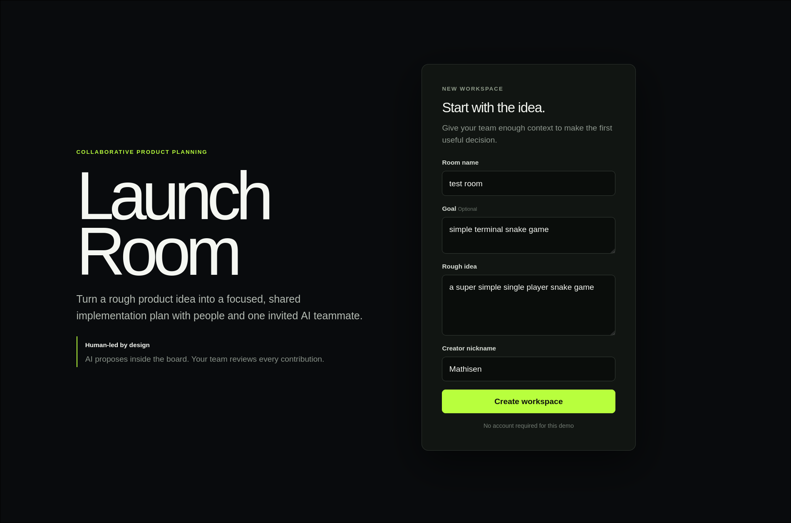
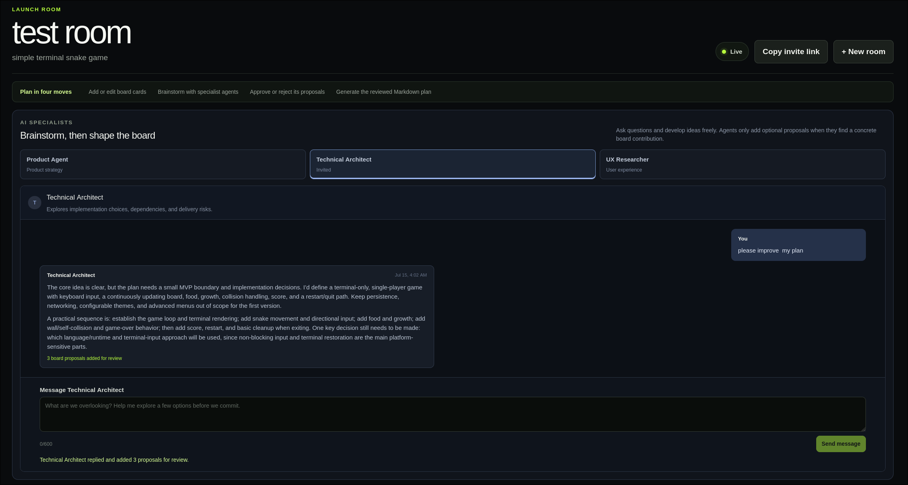
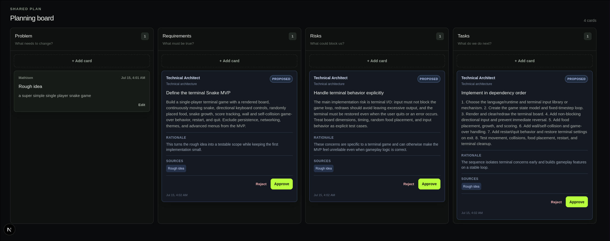
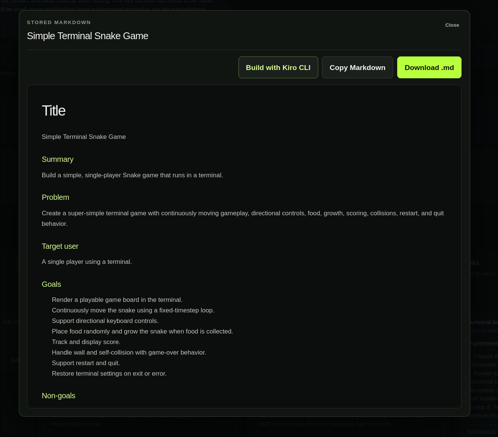
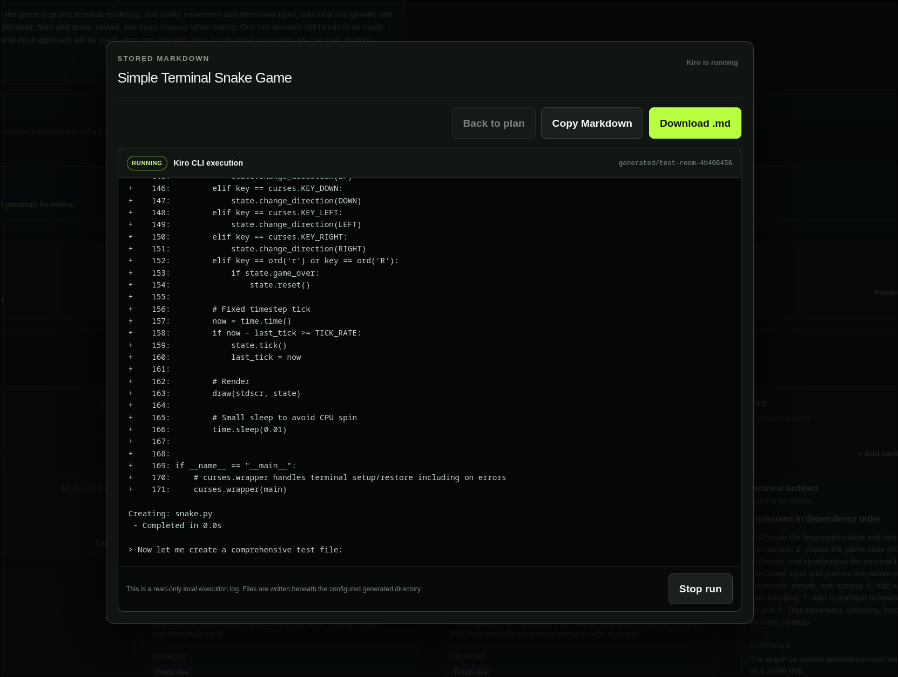
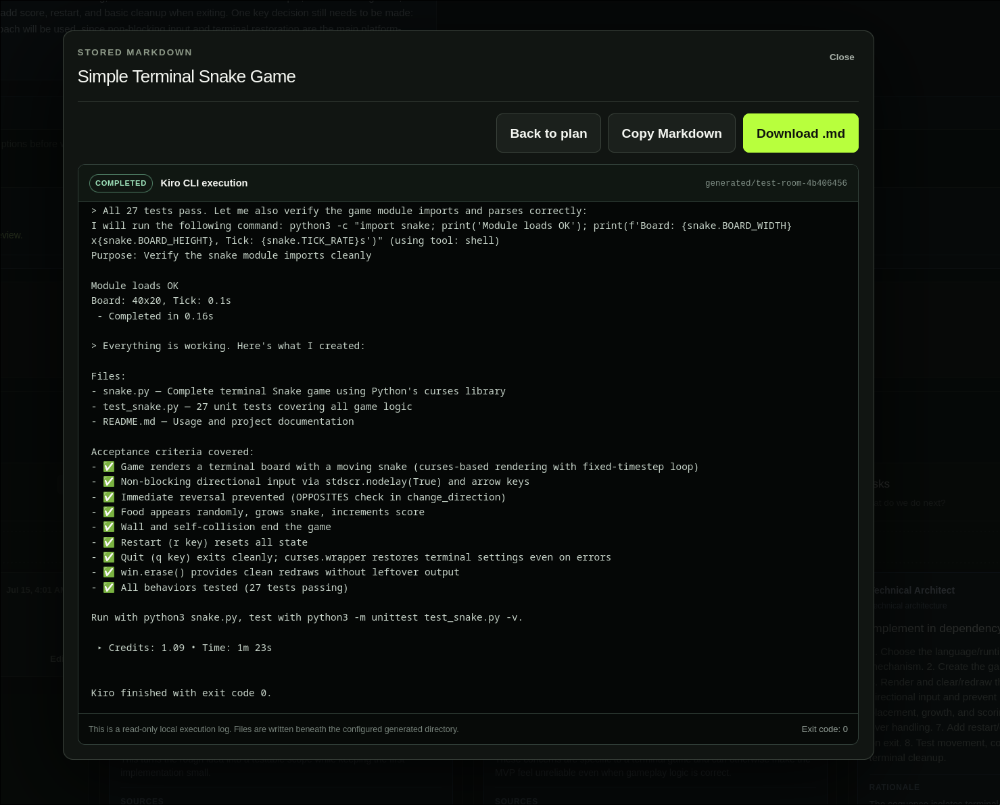

# Launch Room

Launch Room is a local-first multiplayer planning workspace where people and AI specialists turn a rough idea into an approved implementation plan—and can optionally hand that plan to Kiro CLI to build it.

Humans own the shared board. AI teammates can discuss the idea, remember recent room context, and suggest concrete cards, but every proposal must be approved or rejected by a person before it can influence the final Markdown plan.



## What it does

- Creates shareable, nickname-only planning rooms without accounts.
- Synchronizes participants and board changes between browser sessions.
- Provides Product Agent, Technical Architect, and UX Researcher roles.
- Keeps a visible, role-specific history of human and agent messages.
- Lets agents answer conversationally or propose up to three board cards.
- Keeps proposed AI cards pending until a human approves or rejects them.
- Generates a structured Markdown plan from human cards and approved AI work.
- Copies or downloads the final plan without changing its stored contents.
- Optionally executes the approved plan with local Kiro CLI and streams a read-only build log into the site.

## Walkthrough

### 1. Discuss the idea with a specialist

Invite only the roles you need. Each specialist sees the eligible shared board and its recent room conversation, so follow-up questions retain useful context.



### 2. Review concrete contributions

Agent suggestions appear inside the same four-section planning board as human work. Their role, rationale, and source cards stay visible, and a person decides whether each proposal belongs in the plan.



### 3. Generate the reviewed plan

Finalization uses active human cards and approved AI cards only. Proposed and rejected cards are excluded. The resulting Markdown can be previewed, copied, or downloaded.



### 4. Optionally let Kiro build it

When local execution is enabled, Launch Room starts Kiro CLI in a fresh generated directory and streams its progress into a read-only terminal view. The browser cannot enter commands or choose an arbitrary path.



The run finishes with a visible status, output directory, verification summary, and exit code.



## Requirements and platform support

Launch Room has only been developed and tested on **Linux**. Native Windows is not supported and is expected to require changes, particularly around Kiro CLI process execution, signals, shell tooling, and native SQLite dependencies. WSL may work but has not been tested.

Required:

- Linux
- Node.js 24
- pnpm 11
- An OpenAI API key for specialist conversations and final-plan generation

Optional for plan execution:

- Kiro CLI installed and authenticated (`kiro-cli 2.10.0` was tested)
- Permission for Kiro to create files and run tools on the local machine

## Quick start

```bash
git clone https://github.com/mathisen99/kiro-multiplayer-agent.git
cd kiro-multiplayer-agent
cp .env.example .env
pnpm install
pnpm run dev
```

Add your OpenAI key to `.env`:

```env
OPENAI_API_KEY=your-key-here
OPENAI_AGENT_MODEL=gpt-5.6-luna
DATABASE_PATH=./data/launch-room.db
ENABLE_KIRO_EXECUTION=false
KIRO_EXECUTION_ROOT=./generated
```

Open [http://localhost:3000](http://localhost:3000), enter a room name, goal, rough idea, and nickname, then select **Create workspace**.

To test multiplayer collaboration, copy the invite link and open it in a private/incognito window or a second browser. Join with another nickname. Visible tabs poll without overlapping requests and normally synchronize in about 1.25 seconds.

### Optional: enable Kiro execution

First make sure Kiro CLI is installed and authenticated:

```bash
kiro-cli --version
kiro-cli doctor
```

Then change `.env` and restart the development server:

```env
ENABLE_KIRO_EXECUTION=true
KIRO_EXECUTION_ROOT=./generated
```

Use the site through `http://localhost:3000`. Kiro execution is rejected when the site is opened through a LAN hostname. Each run receives a new ignored directory beneath `KIRO_EXECUTION_ROOT`.

> **Local execution warning:** This feature gives an AI coding agent permission to create files and run commands on your machine. The dedicated generated directory, fixed server arguments, reduced child-process environment, timeout, and localhost check are guardrails—not an operating-system sandbox. Do not enable it on a hosted server or expose it to untrusted users. Review generated code before running or publishing it.

## Typical workflow

1. Create a workspace and share its invite URL.
2. Add or edit cards under Problem, Requirements, Risks, and Tasks.
3. Invite one or more AI specialists.
4. Brainstorm, ask follow-up questions, and receive optional proposals.
5. Approve or reject every proposed card.
6. Generate and export the reviewed Markdown plan.
7. Optionally confirm **Build with Kiro CLI**, watch the live log, and inspect the generated project.

## Architecture

| Area | Implementation |
| --- | --- |
| Web app | Next.js App Router, React, TypeScript, Tailwind CSS |
| Persistence | Local SQLite through `better-sqlite3`, WAL enabled |
| Multiplayer | Validated room snapshots with visibility-aware polling |
| AI specialists | OpenAI Responses API with Zod structured output |
| Human review | Server-authoritative proposed → approved/rejected transitions |
| Final artifact | Stored Markdown generated from eligible approved content |
| Kiro execution | Node child process, fixed CLI arguments, SSE log streaming |

The application is intentionally single-process and local-first. Room links and browser Client IDs are demo conveniences, not production authentication.

## Built with Kiro

Launch Room was developed from a deliberately small, messy concept into a testable one-day MVP with Kiro’s spec-driven workflow. The Launch Room Spec first turned the idea into explicit requirements: anonymous room creation, two-browser collaboration, shared planning cards, an invited AI teammate, human review, and a useful final artifact. Its design document then mapped those requirements onto the Next.js routes, SQLite records, polling model, structured AI responses, and trust boundaries. The implementation task list kept the work ordered and made the finished scope auditable.

Project Steering files gave Kiro durable guidance beyond an individual prompt. Product steering protected the board-first workflow and demo scope; technical and structure steering constrained the local-first architecture and file organization; agent-behavior steering required compact shared context, grounded suggestions, trusted server metadata, and human approval before AI proposals could affect the final plan.

The repository also includes a post-task quality-gate Hook that runs TypeScript checking and a reusable demo-readiness Skill for auditing the complete collaboration journey. Together, these artifacts made Kiro more than a code generator: it acted as the project’s planning system, implementation guide, behavioral guardrail, and final readiness check.

The complete Kiro artifacts are tracked under [`.kiro`](./.kiro).

## Validation

```bash
pnpm run check:quick  # TypeScript
pnpm run lint         # ESLint
pnpm run build        # production build
pnpm run verify       # all of the above
```

## Current limitations

- Linux is the only tested operating system.
- The app is not designed for serverless deployment or multiple app instances.
- Multiplayer uses polling rather than sockets.
- Nicknames and room URLs are not secure authentication.
- AI and Kiro execution consume the API or Kiro credits of the local operator.
- Kiro run state lives in the current server process; generated files remain on disk, but an interrupted server cannot restore the live log.
- Local Kiro execution is not suitable for hosted or untrusted environments.

## License

No license has been selected yet. All rights are reserved by the repository owner.
